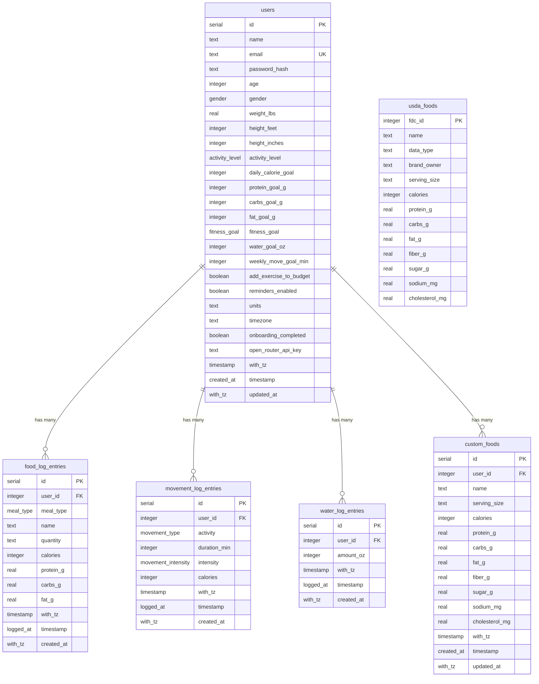

# SparkNourish — Implementation Status & Project Audit

This document provides a comprehensive audit of the **SparkNourish** codebase. It outlines what features are fully implemented, what features are partially implemented, what remains unimplemented, and provides a technical analysis of architectural limitations and recommended next steps.

---

## 1. Executive Summary

SparkNourish is a mobile-first web application designed for daily nutrition and calorie tracking built on **Next.js 16 (App Router)**, **PostgreSQL (via Drizzle ORM)**, and **Tailwind CSS v4**. It is a product of **Sparkwell Creative**.

* **Recently Implemented:**
  * **USDA FoodData Central:** PostgreSQL catalog (`usda_foods`) with 33,000+ imported whole, foundation, survey (FNDDS), and branded foods, including fiber/sugar/sodium/cholesterol. Streaming zip importer script (`scripts/import-usda.ts` / `npm run db:import-usda`).
  * **User Custom Foods:** Dedicated `custom_foods` table, CRUD endpoints, and interactive "+ Create custom food" modal.
  * **Unified Food Search & Serving Multiplier:** Debounced live search across custom foods and USDA items with real-time serving scaling (0.5x, 1x, 1.5x, 2x, custom).
  * **Food Log Edit & Delete:** Full deletion and editing capabilities on meal detail pages (`/meals/[mealId]`), updating totals and macros in real-time.
  * **AI Natural Language Meal Logging:** OpenRouter-powered extraction (`/api/ai/parse-meal`) parsing free-form meal text into structured foods, portions, and macros with one-tap logging.
  * **AI Nutrition Estimation for Custom Foods:** "+ Create custom food" modal can estimate calories, protein, carbs, and fat from the food name/portion via `/api/ai/estimate-food`, with one click filling the form fields.
  * **App-wide Iconography:** `lucide-react` integrated across navigation, meal cards, and action buttons, with a shared `MealIcon` mapping breakfast/lunch/dinner/snacks to distinct icons.
  * **Verdant UI Redesign:** New light design system — forest/coral/amber/lagoon/sand palettes, `Bricolage Grotesque` + `DM Sans` type, 28px card radii and soft shadows. Bottom navigation reworked to Home · Log · Progress · Profile, and the Home, Add food, and Progress screens were rebuilt to match the supplied designs.
  * **Add-food staging cart:** "Recent & frequent" foods (derived from the user's own log history) with multi-select staging and a single "Add to log" commit, plus redesigned quick-action tiles.
  * **Guided onboarding:** Signup is now credentials-only and hands off to a 4-step post-signup flow (`/onboarding`) that collects the fitness goal (lose / maintain / build muscle), body stats and activity level, then computes goal-adjusted calorie and macro targets.
  * **Home / Diary:** Home (`/`) matches the supplied greeting design — a calorie-ring card with a movement-adjusted budget pill, protein/carb/fat goal bars, side-by-side Water + Move tiles and per-meal summary rows, all for the selected day via a compact `?date=YYYY-MM-DD` day picker. Food can be logged into any selected day.
  * **Food detail screen:** New `/food/[id]` route matching the supplied design — serving stepper with Gram/Ounce/household units, daily-goal calorie ring, macro breakdown and fiber/sugar/sodium/cholesterol rows, plus an "Add to <meal>" action.
  * **Profile redesign:** `/profile` now matches the settings design — identity card with goal + streak, editable **Daily targets** (calories, protein, carbs, fat, water), preference rows and the existing AI-key / password / logout controls.
  * **Nutrient data model:** `usda_foods` and `custom_foods` gained `fiber_g`, `sugar_g`, `sodium_mg` and `cholesterol_mg`; the USDA importer captures nutrient IDs 1079/2000/1093/1253.
  * **Movement / exercise tracking:** A full movement feature — `/move` hub (today ring, weekly bars, recent list), `/move/log` activity logger, `/move/timer` live stopwatch, `/move/complete` finish screen, and a weekly-goal step in onboarding. Backed by a `movement_log_entries` table, MET-based calorie estimates, a fifth **Move** nav tab, and a Move tile + "exercise added to budget" pill on Home.
  * **Water tracking:** A `water_log_entries` table with `POST` / `DELETE /api/water`. The Home water tile logs 8 oz glasses (with an undo), fills against the Profile water target, and the Progress "avg water" tile now reports the range average instead of a dash.
  * **All meals view:** The Home "View all" action opens `/meals` — a date-aware list of every meal with item-level calories/macros, a day summary, and per-meal links into the meal-detail editor.
  * **Brand assets:** The official SparkNourish app icon and wordmark logo ship in `public/` and are wired into the Home header, auth screens and the favicon / app-icon metadata.

---

## 2. Technology Stack & Architecture

| Layer | Technologies / Libraries |
| :--- | :--- |
| **Framework** | Next.js 16.3.6 (React 19.2.8, App Router with Server Components) |
| **Database & ORM** | PostgreSQL with Drizzle ORM (`drizzle-orm` v0.45.3, `drizzle-kit` v0.31.11, `postgres` v3.4.9) |
| **Styling** | Tailwind CSS v4 (`@tailwindcss/postcss`) with the **Verdant** theme in `app/globals.css` (`@theme` tokens, `.card`/`.tile` component classes) |
| **Fonts** | `Bricolage Grotesque` (display/headings) + `DM Sans` (body) via `next/font/google`, exposed as `--font-display` / `--font-sans` |
| **Icons** | `lucide-react` v1.50 (named imports tree-shaken via Next.js `optimizePackageImports`) |
| **Authentication** | Custom stateless HMAC-SHA256 session token (`app/_lib/session-token.ts`), HTTP-only cookies |
| **AI Integration** | OpenRouter Chat Completion API (`app/api/ai/parse-meal/route.ts`) |
| **USDA Data Importer** | Streaming zip reader (`yauzl`, `csv-parse`), `scripts/import-usda.ts` |
| **Route Protection** | Next.js Proxy/Middleware (`proxy.ts`) + Server Component guards (`requireUser`, `getSessionUser`) |
| **Tooling** | TypeScript 5, ESLint 9, `tsx` for DB migrations, scripts, and seeding |

---

## 3. Detailed Feature Breakdown

### A. Food Database, Custom Foods & Food Search (`/add-food`)

| Feature | Status | Implementation Details |
| :--- | :---: | :--- |
| **USDA FoodData Central** |  Implemented | `usda_foods` table with 33,694 foods imported from USDA FNDDS, SR Legacy, Foundation, and 20,000 branded foods, including `fiber_g`, `sugar_g`, `sodium_mg`, `cholesterol_mg`. Importer script (`npm run db:import-usda`) streams directly from zip archive. |
| **Custom Foods Catalog** |  Implemented | `custom_foods` table with cascade delete on `user_id`. Indexed by user and food name. |
| **Custom Food Creation UI** |  Implemented | Modal in `app/add-food/FoodSearch.tsx` supporting food name, serving size, calories, protein, carbs, and fat. Includes an AI button that estimates macros from the food name. |
| **AI Nutrition Estimation** |  Implemented | "✨ Estimate nutrition from name" button in the custom food modal calls `POST /api/ai/estimate-food` (OpenRouter) to fill calories, protein, carbs, fat, and serving size. |
| **Unified Food Search** |  Implemented | `GET /api/foods/search?q=...` searches both user's custom foods (with emerald "Custom" badge) and USDA items. |
| **Serving Size Multiplier** |  Implemented | Interactive modal on `/add-food` allowing portion adjustment (0.5x, 1x, 1.5x, 2x, or custom numeric multiplier) with instant macro recalculation. |
| **Recent & Frequent List** |  Implemented | `getRecentFoods()` (`db/queries.ts`) returns the user's most recently logged distinct foods via `DISTINCT ON (name)`, rendered as "Recent & frequent" when the search box is empty. |
| **Staging Cart** |  Implemented | "+" / check buttons stage foods into a pending cart; the fixed dark bar shows meal, item count and total kcal, and "Add to log" commits every staged item in one pass. |
| **Quick-Action Tiles** | ⚠️ Partial | "Quick add" opens the existing AI natural-language logger. "Snap photo" (photo logging) and "My meals" (saved meals) are no-op placeholders — see §6. |
| **Barcode Scanner** | ❌ Not Implemented | UPC/EAN barcode scanning via mobile camera. The scan button in the search bar is a no-op placeholder — see §6. |

---

### A2. Food Detail (`/food/[id]`)

| Feature | Status | Implementation Details |
| :--- | :---: | :--- |
| **Full-Screen Food Detail** | ✅ Implemented | Tapping a custom/USDA search result opens `app/food/[id]/page.tsx`, which loads the food via `getFoodDetail()` and renders the supplied design. |
| **Serving Stepper & Units** | ✅ Implemented | `FoodDetailScreen.tsx` parses the stored serving (`app/_lib/serving.ts`) into a gram weight + household label, then offers Gram/Ounce/household pills with ± stepping and live nutrient scaling. |
| **Daily-Goal Calorie Ring** | ✅ Implemented | Reuses `CalorieRing.tsx` for the `% of day` donut plus the scaled kcal against the user's `dailyCalorieGoal`. |
| **Macro & Micronutrient Breakdown** | ✅ Implemented | Protein/carbs/fat columns scaled to the serving, with per-macro goal bars, followed by Fiber / Sugar / Sodium / Cholesterol rows. |
| **Add to Meal** | ✅ Implemented | Fixed coral "Add to <meal>" button posts to `/api/food-log` (respecting the `meal` and `date` query params) and returns to the Diary. The star/favourite toggle is local-only. |

---

### B. Natural Language Meal Logging (AI)

| Feature | Status | Implementation Details |
| :--- | :---: | :--- |
| **Natural Language Parser** |  Implemented | `POST /api/ai/parse-meal` communicates with OpenRouter (Llama 3.3 70B Instruct / Gemini) to extract items, portions, and macros from natural descriptions. |
| **API Key Storage & Fallback** |  Implemented | Stored per-user in `users.open_router_api_key`, with fallback to `process.env.OPENROUTER_API_KEY`. Prompts user with direct link to `/profile` if missing. |
| **AI Quick Log UI** |  Implemented | Opened from the "Quick add" tile in `FoodSearch.tsx`; provides a prompt input, item breakdown review, and single-tap "Log all N items to [Meal]". The old Search/AI tab switcher was replaced by the design's action tiles. |
| **AI Meal Suggestions** | ❌ Not Implemented | Contextual meal recommendation based on remaining daily calories/macros. |
| **Photo / Vision Meal Logging**| ❌ Not Implemented | Food analysis from uploaded images. |

---

### C. Meal Detail View (`/meals/[mealId]`)

| Feature | Status | Implementation Details |
| :--- | :---: | :--- |
| **Logged Items List** |  Implemented | Displays food name, portion/quantity, individual macronutrients (P, C, F), and calories. |
| **Delete Logged Food** |  Implemented | Trash icon in `MealItemList.tsx` triggers `DELETE /api/food-log/[id]`, immediately updating local state and recalculating meal totals. |
| **Edit Logged Food** |  Implemented | Edit button opens modal to modify food name, quantity, calories, macros, or reassign meal type via `PATCH /api/food-log/[id]`. |
| **Dynamic Macro Bars** |  Implemented | Real-time recalculation of total calories and protein/carbs/fat bars upon editing/deleting items. |
| **Past Date Meal History** | ❌ Not Implemented | Meal detail view is bound to today's date; past logs cannot be reviewed in itemized detail. |

---

### D. Diary / Home (`/`)

| Feature | Status | Implementation Details |
| :--- | :---: | :--- |
| **Greeting Header** | ✅ Implemented | `app/page.tsx` opens with the `BrandMark`, the selected date and a "Good morning / afternoon / evening, {name}" greeting (time-of-day based), plus a settings button linking to `/profile`. |
| **Compact Date Picker** | ✅ Implemented | The selected date is flanked by small ‹ › day arrows that navigate via `?date=YYYY-MM-DD`; the chosen date flows through to the meal rows, `/add-food` and `/api/food-log` so entries can be logged into past/future days. The weekday is rendered from `app/_lib/calendar.ts` (`shortDateLabel`). |
| **Calorie Ring Card** | ✅ Implemented | Daily-goal donut (`CalorieRing`) showing `% of goal` alongside "Remaining today"; when movement calories are added to the budget it relabels to `of budget` and shows the plum "+N from moving" pill. Backed by `getMealsForDate()`. |
| **Macro Bars** | ✅ Implemented | Protein / Carbs / Fat progress bars (`MacroBar`) against the user's per-macro goals, separated from the ring by a hairline rule. |
| **Water & Move Tiles** | ✅ Implemented | Two side-by-side tiles: an interactive `WaterTracker` (lagoon) that logs 8 oz glasses against the Profile water target via `/api/water` with optimistic updates and an undo, and the `MoveTile` (plum) showing `{minutes} min of {dailyMoveGoal}` for the day from `getMovementForDate()`, deep-linking to `/move` and `/move/log`. Water totals come from `getWaterForDate()`. |
| **Per-Meal Rows** | ✅ Implemented | "Today's meals" card lists Breakfast, Lunch, Snack, Dinner with tinted icons, a `P · C · F` summary and meal kcal totals; unlogged meals render the dashed row with a coral "Add" button deep-linking to `/add-food?meal=…&date=…`. Logged rows open `/meals/[mealId]?date=…`. |
| **"View all" Meals** | ✅ Implemented | The Home "View all" action opens `/meals?date=…`, a date-aware all-meals page: a day summary (kcal + `MacroBar` grid) followed by every meal card with its item-level `name / quantity / kcal` and per-item macros. Logged meal headers link to `/meals/[mealId]` for edit/delete; unlogged meals deep-link to `/add-food`. Data comes from `getMealsForDate()`. |
| **Timezone Sensitivity** | ✅ Implemented | `users.timezone` stores the IANA zone (synced from the device on signup/login/load, editable under Profile → Preferences). `app/_lib/calendar.ts` gains zone-aware helpers (`todayMarker`, `dayBoundsForMarker`, `dateKeyInTimeZone`, `markerAtLocalHour`) that compute local-midnight boundaries and bucket instants into the user's local day, including DST/half-hour offsets. All food, movement, water and history queries take the zone, so day boundaries follow the user rather than UTC. |

---

### E. Progress (`/history`)

| Feature | Status | Implementation Details |
| :--- | :---: | :--- |
| **Range Filter** |  Implemented | Segmented control for Week (7 days), Month (30 days) and 3 months (90 days) via `?range=7\|30\|90`. |
| **Daily Average Hero** |  Implemented | Average kcal + goal with the `Sep 28 – Oct 4` range label and a `CalorieBars.tsx` chart: daily bars scaled to the goal, dashed goal line, coral on over-goal days and faint placeholders for empty days. |
| **Day Streak** |  Implemented | `dayStreak()` counts consecutive logged days ending at the most recent day with data (a leading empty day is tolerated). |
| **Macro Split** |  Implemented | `MacroSplit.tsx` stacked bar + legend showing the share of calories from protein/carbs/fat (`macroSplitCalories()`). |
| **Protein Gap Insight** | ⚠️ Partial | Headline/body computed deterministically from the protein gap vs goal. The suggested fix ("A yogurt at breakfast adds 17g") is static copy, not an AI recommendation. See §6. |
| **Average Water** | ✅ Implemented | Stat tile reports the range average from `historyAverages().water`; `getHistory()` sums `water_log_entries` per day alongside food, so the tile updates with the selected range. |
| **Calorie Delta Chart** | 🔁 Superseded | `CalorieDeltaChart.tsx` was removed in the redesign and replaced by `CalorieBars.tsx`. |
| **Meal Breakdown / Daily Log** | 🔁 Superseded | `MealBreakdownBar.tsx` and the reverse-chronological daily log table were removed from the screen to match the Progress design. Day-level data is still produced by `getHistory()`. |
| **Clickable History Days** | ❌ Not Implemented | No itemized drill-down from a history day into the foods logged. |
| **Weight Tracking / Trend** | ❌ Not Implemented | No weight logging or weigh-in progression chart. |

---

### F. Profile & Authentication

| Feature | Status | Implementation Details |
| :--- | :---: | :--- |
| **Signup & Onboarding** | ✅ Implemented | Signup (`/signup`) collects name/email/password only; the guided 4-step `/onboarding` flow (Welcome → Goal → About you → Activity) collects the fitness goal + stats + activity and computes goal-adjusted BMR/macro targets (`nutrition.ts`). `requireUser()` funnels incomplete accounts to `/onboarding`. |
| **Password Security** |  Implemented | Salted `scryptSync` hashes with timing attack protection (`db/password.ts`). |
| **Stateless Sessions** |  Implemented | Cookie-based `<userId>.<expiresAtMs>.<hmac>` signed with `SESSION_SECRET`. |
| **Profile Settings** | ✅ Implemented | Redesigned settings screen: identity card (goal + streak) with an Edit modal, editable **Daily targets** (calories/protein/carbs/fat/water), preference rows (reminders toggle, units toggle, connected apps, appearance), plus OpenRouter API key management, password change and logout. |
| **Dynamic Goal Recalculation** | ⚠️ Partial | Daily targets are individually editable and a "Recalculate" action re-derives them from the latest stats + goal; editing stats alone does not auto-recalculate. |
| **Password Reset** | ❌ Not Implemented | No "Forgot Password" or recovery email flow exists. |

### F2. Guided Onboarding (`/onboarding`)

| Feature | Status | Implementation Details |
| :--- | :---: | :--- |
| **Post-signup Wizard** | ✅ Implemented | `OnboardingFlow.tsx` renders a 4-step flow (Welcome → Goal → About you → Activity) with a back button, a 4-segment progress indicator and Skip. `requireUser()` redirects accounts with `onboardingCompleted = false` here. |
| **Fitness Goal** | ✅ Implemented | Matches the supplied design: Lose weight / Maintain / Build muscle cards with tinted icons and a selected check state. Drives the calorie adjustment + macro split in `computeGoals()`. |
| **Stats & Activity** | ✅ Implemented | Collects gender, age, weight, height and activity level; validated client-side and in `POST /api/onboarding`. |
| **Skip** | ✅ Implemented | Completing with Skip fills any unanswered question from server defaults, computes goals and marks onboarding complete. |
| **Existing Accounts** | ✅ Implemented | `onboarding_completed` defaults to `true` for pre-existing rows; only new signups insert `false`. |

### G. Design System & Iconography

| Feature | Status | Implementation Details |
| :--- | :---: | :--- |
| **Verdant Theme** | ✅ Implemented | `app/globals.css` defines the full palette (`forest`, `coral`, `amber`, `lagoon`, `sand`), `--radius-card`/`--radius-tile`, `--shadow-card`, the two font families, plus `.card` / `.tile` component classes. Light-only by design. |
| **Typography** | ✅ Implemented | `Bricolage Grotesque` for display/headings and large numerals, `DM Sans` for body, loaded via `next/font/google` and mapped to `--font-display` / `--font-sans`. |
| **Brand & Logo** | ✅ Implemented | Official assets in `public/` — `BrandMark.tsx` renders the app icon (`/SparkNourishIcon.png`) in the Home header, and login/signup show the wordmark (`/SparkNourishLogo.png`). The favicon and app icons are wired via file conventions (`app/favicon.ico`, `app/icon.png`, `app/apple-icon.png`). Product name **SparkNourish**, a **Sparkwell Creative** product; attribution also appears in the page metadata and profile/auth footers. |
| **Bottom Navigation** | ✅ Implemented | Five tabs — Home (`/`), Log (`/add-food`), Move (`/move`), Progress (`/history`), Profile (`/profile`) — with a forest pill active state. The bar is `fixed` to the device width and always visible while scrolling, reserving safe-area padding on notched phones. The nav hides itself on the immersive `/move/log`, `/move/timer` and `/move/complete` screens. |
| **Icon Library** | ✅ Implemented | `lucide-react` adopted app-wide. Named imports are automatically tree-shaken by Next.js (`optimizePackageImports`). |
| **Meal-Type Icons** | ✅ Implemented | `app/_components/MealIcon.tsx` maps `breakfast → Sunrise`, `lunch → Soup`, `snacks → Apple`, `dinner → Moon`, and exports `mealTint` background/foreground classes. Used on the Home meal cards, meal detail header, and Add-food meal selector. |
| **Button & Action Icons** | ✅ Implemented | Navigation (`Home`, `PlusCircle`, `ChartColumn`, `UserRound`), back (`ChevronLeft`/`ArrowLeft`), add/confirm (`Plus`/`Check`), edit (`Pencil`), delete (`Trash2`), close (`X`), search (`Search`), barcode (`ScanBarcode`), quick actions (`Camera`, `Zap`, `Soup`), AI (`Sparkles`), water (`Droplet`), streak (`Flame`), loading spinners (`Loader2`), show/hide API key (`Eye`/`EyeOff`), and auth/logout (`LogIn`, `UserPlus`, `LogOut`). Movement icons (`Footprints`, `PersonStanding`, `Bike`, `Dumbbell`, `Accessibility`, `Ellipsis`) + `Activity` are mapped by `app/_components/MovementIcon.tsx`. |

---

### H. Movement & Exercise (`/move`)

| Feature | Status | Implementation Details |
| :--- | :---: | :--- |
| **Move Hub** | ✅ Implemented | `app/move/page.tsx` renders the supplied design: a plum today ring (`ProgressRing`) with "minutes to go", a Monday–Sunday week card with a progress bar and daily bars, "Start a walk" / "Log one" actions, a contextual tip card and a tappable "Recent" list. |
| **Weekly Move Goal** | ✅ Implemented | `users.weekly_move_goal_min` (0 = no goal). A soft daily target is derived at five active days (`dailyMoveGoal()`), so 150 min/week → 30 min/day, matching the designs. Set during onboarding or in Profile. |
| **Log Activity (`/move/log`)** | ✅ Implemented | Activity picker (Walk / Run / Bike / Strength / Yoga / Other), quick picks, a duration stepper with 10/20/30/45/60 chips, an Easy/Moderate/Hard segmented control and a live MET-based kcal estimate. Supports editing an existing entry via `?edit=<id>` (PATCH). |
| **Live Timer (`/move/timer`)** | ✅ Implemented | Full-screen stopwatch with a plum progress ring against the target, elapsed `mm:ss`, kcal-so-far and minutes-to-goal stats, rotating encouragement, pause/resume, and a "Finish …" action that logs the elapsed time. Auto-starts; warns before discarding a session. The target activity and target time are both adjustable mid-session — tapping the activity pill opens a six-activity picker and tapping the target inside the ring opens a stepper/quick-chip editor. |
| **Completion Screen (`/move/complete`)** | ✅ Implemented | Confetti hero with a check, "Nice {activity}, {name}", the duration/calorie summary, the updated week card ("… minutes to go. You've moved N days this week."), an **Add N kcal to today's budget** toggle (`users.add_exercise_to_budget`), Done and Edit details. |
| **Calorie Estimate** | ✅ Implemented | `estimateCalories()` (`app/_lib/movement.ts`) uses activity MET values × intensity factor × body weight × hours. The client preview and the server write share the same helper so numbers always agree. |
| **Budget Integration** | ✅ Implemented | Home adds the day's movement calories to the calorie budget when `add_exercise_to_budget` is on and shows a plum "+N from moving" pill; the Move tile shows `minutes of daily target`. |
| **Onboarding Goal** | ✅ Implemented | A fifth onboarding step ("How much do you want to move?") offers Ease in (90) / Steady (150, Suggested) / Active (250) plus "No movement goal", writing `weekly_move_goal_min`. |
| **Profile Controls** | ✅ Implemented | New Movement card: editable weekly goal modal and an "Add exercise to calories" on/off row. |

---

## 4. Database Schema

---

## 5. API Endpoints Matrix

| Endpoint | Method | Implemented? | Description |
| :--- | :---: | :---: | :--- |
| `/api/auth/signup` | `POST` |  Yes | Validates input, calculates initial goals, hashes password, creates user, issues session cookie. |
| `/api/auth/login` | `POST` |  Yes | Validates credentials, sets session cookie. Protected against timing attacks. |
| `/api/auth/logout` | `POST` |  Yes | Deletes session cookie. |
| `/api/profile` | `GET` |  Yes | Returns authenticated user profile (excluding `passwordHash`). |
| `/api/profile` | `PATCH` |  Yes | Updates allowed profile attributes. |
| `/api/profile/password` | `POST` |  Yes | Verifies current password and sets new password hash. |
| `/api/profile/timezone` | `POST` |  Yes | Syncs the stored IANA time zone with the device; no-op (no write) when unchanged. Called on load by `TimeZoneSync`. |
| `/api/onboarding` | `POST` | Yes | Validates (or defaults, when `skip`), saves goal + health profile and writes computed calorie/macro targets; marks `onboardingCompleted`. |
| `/api/food-log` | `POST` |  Yes | Inserts a new entry into `food_log_entries`. Accepts an optional `date` (`YYYY-MM-DD`) to log into a selected Diary day. |
| `/api/food-log/[id]` | `PATCH` |  Yes | Updates an existing food log entry's quantity, macros, name, or meal type. |
| `/api/food-log/[id]` | `DELETE`|  Yes | Removes a food log entry belonging to the user. |
| `/api/movement` | `POST` |  Yes | Logs a movement entry (activity, minutes, intensity); calories are estimated server-side from the user's weight. |
| `/api/movement/[id]` | `PATCH` |  Yes | Updates a movement entry's activity, duration and intensity (and recomputes calories). |
| `/api/movement/[id]` | `DELETE`|  Yes | Removes a movement entry belonging to the user. |
| `/api/water` | `POST` |  Yes | Logs a water entry (`amountOz`, optional `date`); the Home tile posts an 8 oz glass. |
| `/api/water` | `DELETE`|  Yes | Removes the most recent water entry for the given `date` (the tile's undo). |
| `/api/custom-foods` | `GET` |  Yes | Returns all custom foods created by authenticated user. |
| `/api/custom-foods` | `POST` |  Yes | Creates a new custom food item. |
| `/api/custom-foods/[id]` | `DELETE`|  Yes | Deletes a custom food item owned by the user. |
| `/api/foods/search` | `GET` |  Yes | Searches across custom foods and USDA foods with `q` query parameter. |
| `/api/ai/parse-meal` | `POST` |  Yes | Parses natural language meal text into structured foods & macros using OpenRouter. |
| `/api/ai/estimate-food` | `POST` |  Yes | Estimates calories, protein, carbs, and fat for a single named food using OpenRouter. |

---

## 6. Design No-Ops (Intentionally Non-Functional)

The following elements are present in the product designs but have no backing
data or behaviour yet. They render for design fidelity only; each is a `no-op`
(no state, no network call) and is flagged here so it is not mistaken for a bug.

| UI Element | Location | Reason |
| :--- | :--- | :--- |
| "Snap photo" tile | Add food (`FoodSearch.tsx`) | Photo/vision meal logging is not implemented. |
| "My meals" tile | Add food (`FoodSearch.tsx`) | Saved/favourite multi-item meals are not implemented. |
| Barcode scan button | Add food search bar | Barcode scanning is not implemented (`getRecentFoods` powers the list instead). |
| Protein-gap fix tip ("A yogurt at breakfast adds 17g") | Progress insight card | Static copy; no AI recommendation engine. The headline/gap value are computed for real. |
| Favourite star | Food detail (`/food/[id]`) | Local toggle only; there is no favourites table or endpoint. |
| Connected apps · Appearance rows | Profile (`ProfileForm.tsx`) | Static rows; no Health integration and no dark theme exist. |
| Reminders toggle | Profile | Persists `users.reminders_enabled` but schedules no notifications. |
| Recent-food detail view | Add food (`FoodSearch.tsx`) | Historical "recent" rows keep the portion modal — they have no stable id or nutrient data for `/food/[id]`. |

---

## 7. Task Log

| ID | Task | Status | Notes |
| :--- | :--- | :---: | :--- |
| T-001 | Verdant UI redesign (theme + Home / Add food / Progress) | ✅ Completed | Applied the supplied theme, rebuilt the three designed screens, restyled nav, meal detail, profile and auth. Introduced `getRecentFoods()` and a staging cart, plus day-streak / macro-split derivations. `npm run lint`, `npx tsc --noEmit` and `npm run build` all pass. |
| T-002 | Rebrand product to SparkNourish (Sparkwell Creative) | ✅ Completed | Renamed product strings, metadata (`title`/`applicationName`/`authors`/`publisher`), OpenRouter `X-Title`s and the npm package name. Added a site-wide `BrandMark` placeholder logo and "A Sparkwell Creative product" attribution on login, signup and profile. |
| T-003 | Guided post-signup onboarding | ✅ Completed | Signup is credentials-only; added `/onboarding` (Welcome → Goal → About you → Activity) + `POST /api/onboarding`, a `fitness_goal` enum and `onboarding_completed` flag, and goal-aware `computeGoals()`. `requireUser()` funnels incomplete accounts to onboarding. |
| T-004 | Diary redesign with date navigation | 🔁 Superseded | Rebuilt Home as a week-strip Diary (Monday–Sunday strip, consumed/remaining bar, per-meal item cards) and added `getMealsForDate()` / date-aware `getMealEntries()` plus `date` support on `/add-food` + `/api/food-log`. The week-strip layout was later replaced by the greeting Home design in T-008; the date-navigation helpers in `app/_lib/calendar.ts` remain. |
| T-005 | Food detail screen + nutrient data | ✅ Completed | New `/food/[id]` screen (serving stepper, calorie ring, macro/micro rows, Add to meal). Added `fiber_g`/`sugar_g`/`sodium_mg`/`cholesterol_mg` to `usda_foods` + `custom_foods`, extended the importer, and re-imported 33,694 USDA foods. |
| T-006 | Profile redesign | ✅ Completed | `/profile` rebuilt to the settings design: identity card (goal + streak), editable Daily targets incl. water, reminder/units/preferences rows, and retained AI key, password and logout. |
| T-007 | Movement / exercise tracking | ✅ Completed | New `/move` hub, `/move/log` activity logger, `/move/timer` live timer, `/move/complete` finish screen and a movement step in onboarding. Adds a `movement_log_entries` table, weekly move goal + "add exercise to calories" user settings, a fifth Move nav tab, a Move tile and exercise-calorie budget pill on Home, and a Movement section in Profile. `npm run lint`, `npx tsc --noEmit` and `npm run build` all pass. |
| T-008 | Home screen: greeting design + Move tile | ✅ Completed | Rebuilt Home (`/`) to the pre-movement greeting design with a movement tile: `BrandMark` header with a compact ‹ › day picker, `CalorieRing` card (now supports an `of budget` caption when movement is added, with the plum "+N from moving" pill), `MacroBar` grid, side-by-side `WaterTracker` + new `MoveTile`, and per-meal summary rows with a "View all" action (later wired up in T-010). Added `app/_components/MoveTile.tsx`, made `CalorieRing`'s caption configurable and reworked `WaterTracker` into a compact tile. Removed the T-004 week strip. `npm run lint`, `npx tsc --noEmit` and `npm run build` all pass. |
| T-009 | Water tracking | ✅ Completed | New `water_log_entries` table (migration `0004_clear_spectrum.sql`) and `POST` / `DELETE /api/water`. `WaterTracker` is now a client component that logs 8 oz glasses against `users.water_goal_oz` with optimistic updates and an undo, and `getHistory()` sums water per day so the Progress "avg water" tile reports the range average. `npm run lint`, `npx tsc --noEmit` and `npm run build` all pass; the query layer was smoke-tested against Postgres (add → 8, undo → 0). |
| T-010 | All meals page | ✅ Completed | New `/meals` list route alongside `/meals/[mealId]`: a date-aware day summary (kcal + `MacroBar` grid) and item-level meal cards (`getMealsForDate()`), with logged headers linking to the detail editor and unlogged meals deep-linking to `/add-food`. The Home "View all" action now links to `/meals?date=…`, and the design no-op was removed. `npm run lint`, `npx tsc --noEmit` and `npm run build` all pass. |
| T-011 | Brand icon & logo | ✅ Completed | Wired the supplied assets in `public/`: `BrandMark` renders `SparkNourishIcon.png` (Home header), login/signup show the `SparkNourishLogo.png` wordmark, and `app/favicon.ico` / `app/icon.png` / `app/apple-icon.png` supply the favicon and app icons. Verified the rendered `<head>` emits all three icon links and the assets return 200. `npm run lint`, `npx tsc --noEmit` and `npm run build` all pass. |
| T-012 | Fix: public assets blocked by auth proxy | ✅ Completed | The `proxy.ts` matcher auth-redirected every non-API path, including `public/` files, so unauthenticated pages (login/signup) got a 307 → `/login` for `/SparkNourishIcon.png`. The image optimizer fetched that HTML and failed with "The requested resource isn't a valid image … received null". Added an image-extension exclusion to the matcher; assets now return 200 without a session and the optimizer returns the PNG. `npm run lint` and `npm run build` pass. |
| T-013 | Move timer: adjustable activity & target | ✅ Completed | `MovementTimer.tsx` now keeps the activity and target in local state instead of fixed props. The header activity pill is a button that opens a six-activity picker (Walk/Run/Bike/Strength/Yoga/Other), and the target inside the ring opens a modal with ±5-min stepping and 10/20/30/45/60 chips (clamped 1–600). Changing either updates the icon, calorie estimate, progress ring and encouragement live. `npm run lint`, `npx tsc --noEmit` and `npm run build` all pass. |
| T-014 | Mobile layout: persistent full-width bottom nav + Home horizontal-overflow fix | ✅ Completed | The bottom nav is now `fixed inset-x-0 bottom-0` so it spans the device width and stays visible on every screen while scrolling; `BottomNav` emits a spacer that reserves its height (plus `env(safe-area-inset-bottom)`), and the root layout opts into `viewportFit: "cover"` with a sand `themeColor`. The nav pill/label were tightened (`w-12`, `truncate`) for narrow screens. On Home the Water + Move tiles moved from `flex` to `grid grid-cols-2` (whose `minmax(0,1fr)` tracks cannot overflow), and each tile header keeps the icon + label on the left and its action button on the right on a single, non-wrapping line (`truncate` protects the label). The Water tile's minus was removed from the header — tapping the **Water** label now opens a modal with a large oz readout, progress bar and −/+ glass stepper (plus Done), while the tile's + still logs a glass instantly. The Add-food staging cart and the Food-detail action bar now offset by the nav height + safe-area inset; `html`/`body` carry `overflow-x-hidden` as a net. `npm run lint`, `npx tsc --noEmit` and `npm run build` all pass. |
| T-015 | Timezone-sensitive day boundaries | ✅ Completed | Added `users.timezone` (migration `0005_boring_titania.sql`) plus zone-aware calendar helpers in `app/_lib/calendar.ts` (`isValidTimeZone`/`resolveTimeZone`, `dateKeyInTimeZone`, `dayBoundsInTimeZone`/`dayBoundsForMarker`, `todayKey`/`todayMarker`, `markerAtLocalHour`) that convert local midnight to UTC instants and handle DST/half-hour zones. Every day-scoped query (`getMealsForDate`, `getMealEntries`, `getLastLoggedMealToday`, `getHistory`, `getMovementForDate`/`Overview`, `getWaterForDate`, `deleteLatestWaterEntry`) now takes the user's zone; pages/route handlers pass `resolveTimeZone(user.timezone)`, back-dated entries are stamped at local noon, and meal times/history buckets/movement weeks use local days. The zone is captured on signup/login, re-synced on load by `TimeZoneSync` → `POST /api/profile/timezone` (no-op when unchanged), and editable under Profile → Preferences. Verified the offset/DST math with a throwaway script and `npm run lint` / `npx tsc --noEmit` / `npm run build` all pass. |

---

## 8. Recommended Next Steps

1. **Saved Meals / Recipes:** Back the "My meals" tile with reusable meal templates that can be staged in one tap.
2. **Barcode Scanning:** Mobile camera barcode scanning for packaged foods.
3. **Clickable History Days:** Allow users to tap a day on Progress to review the foods logged that day (day-level data already exists).
4. **Favourites:** Back the food-detail star with a `favourite_foods` table and surface favourites in Add food.
5. **Notifications:** Turn the Profile reminders toggle into scheduled meal/water/movement nudges.
6. **Movement insights:** Surface movement in Progress (weekly trend + streaks) and let logged sessions be deleted/edited from the Move screen (the PATCH/DELETE endpoints already exist).
7. **Water history insight:** Add a per-day water trend/streak to Progress now that `water_log_entries` exists.

