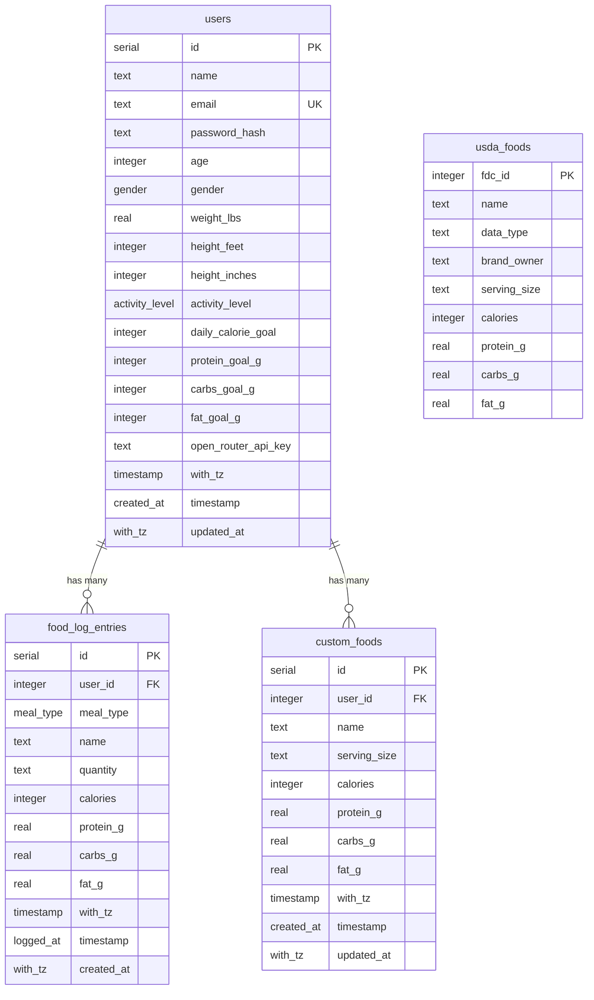

# Sparkwell Nutrition — Implementation Status & Project Audit

This document provides a comprehensive audit of the **Sparkwell Nutrition** codebase. It outlines what features are fully implemented, what features are partially implemented, what remains unimplemented, and provides a technical analysis of architectural limitations and recommended next steps.

---

## 1. Executive Summary

Sparkwell Nutrition is a mobile-first web application designed for daily nutrition and calorie tracking built on **Next.js 16 (App Router)**, **PostgreSQL (via Drizzle ORM)**, and **Tailwind CSS v4**.

* **Recently Implemented:**
  * **USDA FoodData Central:** PostgreSQL catalog (`usda_foods`) with 14,000+ imported whole, foundation, survey (FNDDS), and branded foods. Streaming zip importer script (`scripts/import-usda.ts` / `npm run db:import-usda`).
  * **User Custom Foods:** Dedicated `custom_foods` table, CRUD endpoints, and interactive "+ Create custom food" modal.
  * **Unified Food Search & Serving Multiplier:** Debounced live search across custom foods and USDA items with real-time serving scaling (0.5x, 1x, 1.5x, 2x, custom).
  * **Food Log Edit & Delete:** Full deletion and editing capabilities on meal detail pages (`/meals/[mealId]`), updating totals and macros in real-time.
  * **AI Natural Language Meal Logging:** OpenRouter-powered extraction (`/api/ai/parse-meal`) parsing free-form meal text into structured foods, portions, and macros with one-tap logging.
  * **AI Nutrition Estimation for Custom Foods:** "+ Create custom food" modal can estimate calories, protein, carbs, and fat from the food name/portion via `/api/ai/estimate-food`, with one click filling the form fields.
  * **App-wide Iconography:** `lucide-react` integrated across navigation, meal cards, and action buttons, with a shared `MealIcon` mapping breakfast/lunch/dinner/snacks to distinct icons.

---

## 2. Technology Stack & Architecture

| Layer | Technologies / Libraries |
| :--- | :--- |
| **Framework** | Next.js 16.3.6 (React 19.2.8, App Router with Server Components) |
| **Database & ORM** | PostgreSQL with Drizzle ORM (`drizzle-orm` v0.45.3, `drizzle-kit` v0.31.11, `postgres` v3.4.9) |
| **Styling** | Tailwind CSS v4 (`@tailwindcss/postcss`) |
| **Icons** | `lucide-react` v1.50 (named imports tree-shaken via Next.js `optimizePackageImports`) |
| **Authentication** | Custom stateless HMAC-SHA256 session token (`app/_lib/session-token.ts`), HTTP-only cookies |
| **AI Integration** | OpenRouter Chat Completion API (`app/api/ai/parse-meal/route.ts`) |
| **USDA Data Importer** | Streaming zip reader (`yauzl`, `csv-parse`), `scripts/import-usda.ts` |
| **Route Protection** | Next.js Proxy/Middleware (`proxy.ts`) + Server Component guards (`requireUser`, `getSessionUser`) |
| **Tooling** | TypeScript 5, ESLint 9, `tsx` for DB migrations, scripts, and seeding |

---

## 3. Detailed Feature Breakdown

### A. Food Database, Custom Foods & Food Search (`/add-food`)

| Feature | Status | Implementation Details |
| :--- | :---: | :--- |
| **USDA FoodData Central** |  Implemented | `usda_foods` table with 14,194 foods imported from USDA FNDDS, SR Legacy, Foundation, and top branded foods. Importer script (`npm run db:import-usda`) streams directly from zip archive. |
| **Custom Foods Catalog** |  Implemented | `custom_foods` table with cascade delete on `user_id`. Indexed by user and food name. |
| **Custom Food Creation UI** |  Implemented | Modal in `app/add-food/FoodSearch.tsx` supporting food name, serving size, calories, protein, carbs, and fat. Includes an AI button that estimates macros from the food name. |
| **AI Nutrition Estimation** |  Implemented | "✨ Estimate nutrition from name" button in the custom food modal calls `POST /api/ai/estimate-food` (OpenRouter) to fill calories, protein, carbs, fat, and serving size. |
| **Unified Food Search** |  Implemented | `GET /api/foods/search?q=...` searches both user's custom foods (with emerald "Custom" badge) and USDA items. |
| **Serving Size Multiplier** |  Implemented | Interactive modal on `/add-food` allowing portion adjustment (0.5x, 1x, 1.5x, 2x, or custom numeric multiplier) with instant macro recalculation. |
| **Barcode Scanner** | ❌ Not Implemented | UPC/EAN barcode scanning via mobile camera. |

---

### B. Natural Language Meal Logging (AI)

| Feature | Status | Implementation Details |
| :--- | :---: | :--- |
| **Natural Language Parser** |  Implemented | `POST /api/ai/parse-meal` communicates with OpenRouter (Llama 3.3 70B Instruct / Gemini) to extract items, portions, and macros from natural descriptions. |
| **API Key Storage & Fallback** |  Implemented | Stored per-user in `users.open_router_api_key`, with fallback to `process.env.OPENROUTER_API_KEY`. Prompts user with direct link to `/profile` if missing. |
| **AI Quick Log UI** |  Implemented | Tabbed view in `FoodSearch.tsx` featuring prompt input, item breakdown review, and single-tap "Log all items to [Meal]". |
| **AI Meal Suggestions** | ❌ Not Implemented | Contextual meal recommendation based on remaining daily calories/macros. |
| **Photo / Vision Meal Logging**| ❌ Not Implemented | Food analysis from uploaded images. |

---

### C. Meal Detail View (`/meals/[mealId]`)

| Feature | Status | Implementation Details |
| :--- | :---: | :--- |
| **Logged Items List** |  Implemented | Displays food name, portion/quantity, individual macronutrients (P, C, F), and calories. |
| **Delete Logged Food** |  Implemented | Trash icon in `MealItemList.tsx` triggers `DELETE /api/food-log/[id]`, immediately updating local state and recalculating meal totals. |
| **Edit Logged Food** |  Implemented | Edit button opens modal to modify food name, quantity, calories, macros, or reassign meal type via `PATCH /api/food-log/[id]`. |
| **Dynamic Macro Bars** |  Implemented | Real-time recalculation of total calories and protein/carbs/fat bars upon editing/deleting items. |
| **Past Date Meal History** | ❌ Not Implemented | Meal detail view is bound to today's date; past logs cannot be reviewed in itemized detail. |

---

### D. Dashboard / Home (`/`)

| Feature | Status | Implementation Details |
| :--- | :---: | :--- |
| **Daily Overview Header** |  Implemented | Current date, dynamic greeting based on time of day, and user first name. Quick link avatar to `/profile`. |
| **Calorie Progress Gauge** |  Implemented | Displays remaining calories (`dailyGoal - consumed`), consumed vs goal, and visual fill progress bar capped at 100%. |
| **Macronutrient Progress** |  Implemented | `MacroBar.tsx` displays consumed grams vs goal for Protein (sky), Carbs (amber), and Fat (violet). |
| **Today's Meals List** |  Implemented | Cards for Breakfast, Lunch, Dinner, and Snacks showing logged item count, earliest log timestamp, and total calories per meal. |
| **Date Navigation** | ❌ Not Implemented | Dashboard is strictly bound to today. Users cannot navigate back to yesterday or view past/future dates. |
| **Timezone Sensitivity** | ⚠️ Partial | Server queries calculate start-of-day in UTC (`startOfDayUtc`), which can cause mismatch around day boundaries. |

---

### E. Trends & History (`/history`)

| Feature | Status | Implementation Details |
| :--- | :---: | :--- |
| **Range Filter** |  Implemented | Toggle between Last 7 days and Last 30 days (`?range=7` or `?range=30`). |
| **Summary Metrics** |  Implemented | Avg calories/day (with delta vs goal), Avg protein/day, Days on target (within ±10%), and Peak calorie day. |
| **Calorie Delta Bar Chart** |  Implemented | Custom responsive CSS chart (`CalorieDeltaChart.tsx`) comparing each day's delta above/below the goal line, with hover tooltips. |
| **Macro Daily Averages** |  Implemented | Average daily protein, carbs, and fat intake vs goals. |
| **Meal Calorie Breakdown** |  Implemented | `MealBreakdownBar.tsx` stacked bar chart displaying percentage of calories from breakfast, lunch, dinner, snacks. |
| **Daily Log Table** |  Implemented | Reverse-chronological table listing each date, calorie total, macros, and on-goal indicator dot. |
| **Clickable History Days** | ❌ Not Implemented | Rows in the daily log table are plain text and cannot be clicked to inspect what foods were eaten on that date. |
| **Weight Tracking / Trend** | ❌ Not Implemented | No weight logging or weigh-in progression chart. |

---

### F. Profile & Authentication

| Feature | Status | Implementation Details |
| :--- | :---: | :--- |
| **Signup & Onboarding** |  Implemented | 2-step onboarding with automatic BMR/macro calculations (`nutrition.ts`). |
| **Password Security** |  Implemented | Salted `scryptSync` hashes with timing attack protection (`db/password.ts`). |
| **Stateless Sessions** |  Implemented | Cookie-based `<userId>.<expiresAtMs>.<hmac>` signed with `SESSION_SECRET`. |
| **Profile Settings** |  Implemented | Basic info editing, OpenRouter API key management, password change, and logout. |
| **Dynamic Goal Recalculation** | ⚠️ Partial | When user changes weight or activity level in Profile, daily calorie and macro goals are not automatically updated. |
| **Password Reset** | ❌ Not Implemented | No "Forgot Password" or recovery email flow exists. |

### G. Design System & Iconography

| Feature | Status | Implementation Details |
| :--- | :---: | :--- |
| **Icon Library** | ✅ Implemented | `lucide-react` added as a dependency and adopted app-wide, replacing hand-rolled inline SVGs. Named imports are automatically tree-shaken by Next.js (`optimizePackageImports`). |
| **Meal-Type Icons** | ✅ Implemented | Shared `app/_components/MealIcon.tsx` maps `breakfast → Coffee`, `lunch → Sandwich`, `dinner → UtensilsCrossed`, and `snacks → Cookie`. Used on dashboard meal cards, the meal detail header, the Add Food meal-selector chips, and the history meal-breakdown legend. |
| **Button & Action Icons** | ✅ Implemented | Navigation (`Home`, `PlusCircle`, `ChartColumn`), back (`ChevronLeft`), add (`Plus`/`Check`), edit (`Pencil`), delete (`Trash2`), close (`X`), search (`Search`), AI (`Sparkles`), loading spinners (`Loader2`), show/hide API key (`Eye`/`EyeOff`), and auth/logout (`LogIn`, `UserPlus`, `LogOut`) actions. |

---

## 4. Database Schema

---

## 5. API Endpoints Matrix

| Endpoint | Method | Implemented? | Description |
| :--- | :---: | :---: | :--- |
| `/api/auth/signup` | `POST` |  Yes | Validates input, calculates initial goals, hashes password, creates user, issues session cookie. |
| `/api/auth/login` | `POST` |  Yes | Validates credentials, sets session cookie. Protected against timing attacks. |
| `/api/auth/logout` | `POST` |  Yes | Deletes session cookie. |
| `/api/profile` | `GET` |  Yes | Returns authenticated user profile (excluding `passwordHash`). |
| `/api/profile` | `PATCH` |  Yes | Updates allowed profile attributes. |
| `/api/profile/password` | `POST` |  Yes | Verifies current password and sets new password hash. |
| `/api/food-log` | `POST` |  Yes | Inserts a new entry into `food_log_entries`. |
| `/api/food-log/[id]` | `PATCH` |  Yes | Updates an existing food log entry's quantity, macros, name, or meal type. |
| `/api/food-log/[id]` | `DELETE`|  Yes | Removes a food log entry belonging to the user. |
| `/api/custom-foods` | `GET` |  Yes | Returns all custom foods created by authenticated user. |
| `/api/custom-foods` | `POST` |  Yes | Creates a new custom food item. |
| `/api/custom-foods/[id]` | `DELETE`|  Yes | Deletes a custom food item owned by the user. |
| `/api/foods/search` | `GET` |  Yes | Searches across custom foods and USDA foods with `q` query parameter. |
| `/api/ai/parse-meal` | `POST` |  Yes | Parses natural language meal text into structured foods & macros using OpenRouter. |
| `/api/ai/estimate-food` | `POST` |  Yes | Estimates calories, protein, carbs, and fat for a single named food using OpenRouter. |

---

## 6. Recommended Next Steps

1. **Date Navigation on Dashboard:** Add previous/next day navigation (`< Yesterday | Today | Tomorrow >`) to allow logging and viewing meals across any date.
2. **Clickable History Days:** Allow users to tap on dates in the `/history` table to review what foods were logged on that specific day.
3. **Macro Goals Customization:** Add ability to customize macro ratios (% or grams) on the Profile page.
4. **Barcode Scanning:** Mobile camera barcode scanning for packaged foods.
