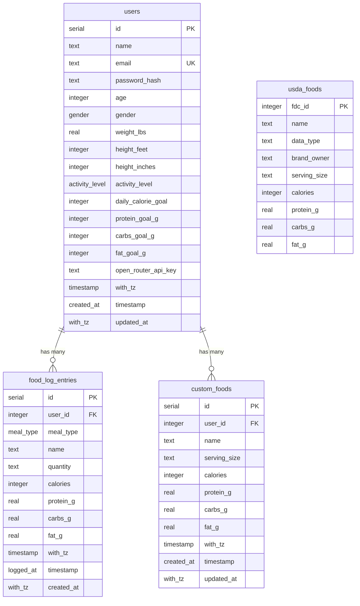

# SparkNourish — Implementation Status & Project Audit

This document provides a comprehensive audit of the **SparkNourish** codebase. It outlines what features are fully implemented, what features are partially implemented, what remains unimplemented, and provides a technical analysis of architectural limitations and recommended next steps.

---

## 1. Executive Summary

SparkNourish is a mobile-first web application designed for daily nutrition and calorie tracking built on **Next.js 16 (App Router)**, **PostgreSQL (via Drizzle ORM)**, and **Tailwind CSS v4**. It is a product of **Sparkwell Creative**.

* **Recently Implemented:**
  * **USDA FoodData Central:** PostgreSQL catalog (`usda_foods`) with 14,000+ imported whole, foundation, survey (FNDDS), and branded foods. Streaming zip importer script (`scripts/import-usda.ts` / `npm run db:import-usda`).
  * **User Custom Foods:** Dedicated `custom_foods` table, CRUD endpoints, and interactive "+ Create custom food" modal.
  * **Unified Food Search & Serving Multiplier:** Debounced live search across custom foods and USDA items with real-time serving scaling (0.5x, 1x, 1.5x, 2x, custom).
  * **Food Log Edit & Delete:** Full deletion and editing capabilities on meal detail pages (`/meals/[mealId]`), updating totals and macros in real-time.
  * **AI Natural Language Meal Logging:** OpenRouter-powered extraction (`/api/ai/parse-meal`) parsing free-form meal text into structured foods, portions, and macros with one-tap logging.
  * **AI Nutrition Estimation for Custom Foods:** "+ Create custom food" modal can estimate calories, protein, carbs, and fat from the food name/portion via `/api/ai/estimate-food`, with one click filling the form fields.
  * **App-wide Iconography:** `lucide-react` integrated across navigation, meal cards, and action buttons, with a shared `MealIcon` mapping breakfast/lunch/dinner/snacks to distinct icons.
  * **Verdant UI Redesign:** New light design system — forest/coral/amber/lagoon/sand palettes, `Bricolage Grotesque` + `DM Sans` type, 28px card radii and soft shadows. Bottom navigation reworked to Home · Log · Progress · Profile, and the Home, Add food, and Progress screens were rebuilt to match the supplied designs.
  * **Add-food staging cart:** "Recent & frequent" foods (derived from the user's own log history) with multi-select staging and a single "Add to log" commit, plus redesigned quick-action tiles.

---

## 2. Technology Stack & Architecture

| Layer | Technologies / Libraries |
| :--- | :--- |
| **Framework** | Next.js 16.3.6 (React 19.2.8, App Router with Server Components) |
| **Database & ORM** | PostgreSQL with Drizzle ORM (`drizzle-orm` v0.45.3, `drizzle-kit` v0.31.11, `postgres` v3.4.9) |
| **Styling** | Tailwind CSS v4 (`@tailwindcss/postcss`) with the **Verdant** theme in `app/globals.css` (`@theme` tokens, `.card`/`.tile` component classes) |
| **Fonts** | `Bricolage Grotesque` (display/headings) + `DM Sans` (body) via `next/font/google`, exposed as `--font-display` / `--font-sans` |
| **Icons** | `lucide-react` v1.50 (named imports tree-shaken via Next.js `optimizePackageImports`) |
| **Authentication** | Custom stateless HMAC-SHA256 session token (`app/_lib/session-token.ts`), HTTP-only cookies |
| **AI Integration** | OpenRouter Chat Completion API (`app/api/ai/parse-meal/route.ts`) |
| **USDA Data Importer** | Streaming zip reader (`yauzl`, `csv-parse`), `scripts/import-usda.ts` |
| **Route Protection** | Next.js Proxy/Middleware (`proxy.ts`) + Server Component guards (`requireUser`, `getSessionUser`) |
| **Tooling** | TypeScript 5, ESLint 9, `tsx` for DB migrations, scripts, and seeding |

---

## 3. Detailed Feature Breakdown

### A. Food Database, Custom Foods & Food Search (`/add-food`)

| Feature | Status | Implementation Details |
| :--- | :---: | :--- |
| **USDA FoodData Central** |  Implemented | `usda_foods` table with 14,194 foods imported from USDA FNDDS, SR Legacy, Foundation, and top branded foods. Importer script (`npm run db:import-usda`) streams directly from zip archive. |
| **Custom Foods Catalog** |  Implemented | `custom_foods` table with cascade delete on `user_id`. Indexed by user and food name. |
| **Custom Food Creation UI** |  Implemented | Modal in `app/add-food/FoodSearch.tsx` supporting food name, serving size, calories, protein, carbs, and fat. Includes an AI button that estimates macros from the food name. |
| **AI Nutrition Estimation** |  Implemented | "✨ Estimate nutrition from name" button in the custom food modal calls `POST /api/ai/estimate-food` (OpenRouter) to fill calories, protein, carbs, fat, and serving size. |
| **Unified Food Search** |  Implemented | `GET /api/foods/search?q=...` searches both user's custom foods (with emerald "Custom" badge) and USDA items. |
| **Serving Size Multiplier** |  Implemented | Interactive modal on `/add-food` allowing portion adjustment (0.5x, 1x, 1.5x, 2x, or custom numeric multiplier) with instant macro recalculation. |
| **Recent & Frequent List** |  Implemented | `getRecentFoods()` (`db/queries.ts`) returns the user's most recently logged distinct foods via `DISTINCT ON (name)`, rendered as "Recent & frequent" when the search box is empty. |
| **Staging Cart** |  Implemented | "+" / check buttons stage foods into a pending cart; the fixed dark bar shows meal, item count and total kcal, and "Add to log" commits every staged item in one pass. |
| **Quick-Action Tiles** | ⚠️ Partial | "Quick add" opens the existing AI natural-language logger. "Snap photo" (photo logging) and "My meals" (saved meals) are no-op placeholders — see §6. |
| **Barcode Scanner** | ❌ Not Implemented | UPC/EAN barcode scanning via mobile camera. The scan button in the search bar is a no-op placeholder — see §6. |

---

### B. Natural Language Meal Logging (AI)

| Feature | Status | Implementation Details |
| :--- | :---: | :--- |
| **Natural Language Parser** |  Implemented | `POST /api/ai/parse-meal` communicates with OpenRouter (Llama 3.3 70B Instruct / Gemini) to extract items, portions, and macros from natural descriptions. |
| **API Key Storage & Fallback** |  Implemented | Stored per-user in `users.open_router_api_key`, with fallback to `process.env.OPENROUTER_API_KEY`. Prompts user with direct link to `/profile` if missing. |
| **AI Quick Log UI** |  Implemented | Opened from the "Quick add" tile in `FoodSearch.tsx`; provides a prompt input, item breakdown review, and single-tap "Log all N items to [Meal]". The old Search/AI tab switcher was replaced by the design's action tiles. |
| **AI Meal Suggestions** | ❌ Not Implemented | Contextual meal recommendation based on remaining daily calories/macros. |
| **Photo / Vision Meal Logging**| ❌ Not Implemented | Food analysis from uploaded images. |

---

### C. Meal Detail View (`/meals/[mealId]`)

| Feature | Status | Implementation Details |
| :--- | :---: | :--- |
| **Logged Items List** |  Implemented | Displays food name, portion/quantity, individual macronutrients (P, C, F), and calories. |
| **Delete Logged Food** |  Implemented | Trash icon in `MealItemList.tsx` triggers `DELETE /api/food-log/[id]`, immediately updating local state and recalculating meal totals. |
| **Edit Logged Food** |  Implemented | Edit button opens modal to modify food name, quantity, calories, macros, or reassign meal type via `PATCH /api/food-log/[id]`. |
| **Dynamic Macro Bars** |  Implemented | Real-time recalculation of total calories and protein/carbs/fat bars upon editing/deleting items. |
| **Past Date Meal History** | ❌ Not Implemented | Meal detail view is bound to today's date; past logs cannot be reviewed in itemized detail. |

---

### D. Dashboard / Home (`/`)

| Feature | Status | Implementation Details |
| :--- | :---: | :--- |
| **Daily Overview Header** |  Implemented | Forest leaf logo badge, current date, dynamic greeting + first name, and a settings (sliders) button linking to `/profile`. |
| **Calorie Progress Gauge** |  Implemented | `CalorieRing.tsx` SVG donut showing % of goal, alongside remaining kcal (`dailyGoal - consumed`) and `eaten · goal`. |
| **Macronutrient Progress** |  Implemented | Three-column `MacroBar.tsx` showing consumed vs goal grams for Protein (forest), Carbs (coral), and Fat (amber). |
| **Today's Meals List** |  Implemented | Breakfast, Lunch, Snack, Dinner rows with tinted meal icons, `P · C · F` summary and kcal; unlogged meals show a coral "Add" button deep-linking to `/add-food?meal=…`. |
| **Water Tracker** | ⚠️ No-op | Water card (droplet, `oz of 80`, tick marks, "+") is rendered on Home for design fidelity but records nothing — no schema column or endpoint exists. See §6. |
| **"View all" Meals** | ⚠️ No-op | Header action on "Today's meals" is a non-functional placeholder; there is no all-meals view. See §6. |
| **Date Navigation** | ❌ Not Implemented | Dashboard is strictly bound to today. Users cannot navigate back to yesterday or view past/future dates. |
| **Timezone Sensitivity** | ⚠️ Partial | Server queries calculate start-of-day in UTC (`startOfDayUtc`), which can cause mismatch around day boundaries. |

---

### E. Progress (`/history`)

| Feature | Status | Implementation Details |
| :--- | :---: | :--- |
| **Range Filter** |  Implemented | Segmented control for Week (7 days), Month (30 days) and 3 months (90 days) via `?range=7\|30\|90`. |
| **Daily Average Hero** |  Implemented | Average kcal + goal with the `Sep 28 – Oct 4` range label and a `CalorieBars.tsx` chart: daily bars scaled to the goal, dashed goal line, coral on over-goal days and faint placeholders for empty days. |
| **Day Streak** |  Implemented | `dayStreak()` counts consecutive logged days ending at the most recent day with data (a leading empty day is tolerated). |
| **Macro Split** |  Implemented | `MacroSplit.tsx` stacked bar + legend showing the share of calories from protein/carbs/fat (`macroSplitCalories()`). |
| **Protein Gap Insight** | ⚠️ Partial | Headline/body computed deterministically from the protein gap vs goal. The suggested fix ("A yogurt at breakfast adds 17g") is static copy, not an AI recommendation. See §6. |
| **Average Water** | ⚠️ No-op | Stat tile shows `—`; water intake is not tracked. See §6. |
| **Calorie Delta Chart** | 🔁 Superseded | `CalorieDeltaChart.tsx` was removed in the redesign and replaced by `CalorieBars.tsx`. |
| **Meal Breakdown / Daily Log** | 🔁 Superseded | `MealBreakdownBar.tsx` and the reverse-chronological daily log table were removed from the screen to match the Progress design. Day-level data is still produced by `getHistory()`. |
| **Clickable History Days** | ❌ Not Implemented | No itemized drill-down from a history day into the foods logged. |
| **Weight Tracking / Trend** | ❌ Not Implemented | No weight logging or weigh-in progression chart. |

---

### F. Profile & Authentication

| Feature | Status | Implementation Details |
| :--- | :---: | :--- |
| **Signup & Onboarding** |  Implemented | 2-step onboarding with automatic BMR/macro calculations (`nutrition.ts`). |
| **Password Security** |  Implemented | Salted `scryptSync` hashes with timing attack protection (`db/password.ts`). |
| **Stateless Sessions** |  Implemented | Cookie-based `<userId>.<expiresAtMs>.<hmac>` signed with `SESSION_SECRET`. |
| **Profile Settings** |  Implemented | Basic info editing, OpenRouter API key management, password change, and logout. |
| **Dynamic Goal Recalculation** | ⚠️ Partial | When user changes weight or activity level in Profile, daily calorie and macro goals are not automatically updated. |
| **Password Reset** | ❌ Not Implemented | No "Forgot Password" or recovery email flow exists. |

### G. Design System & Iconography

| Feature | Status | Implementation Details |
| :--- | :---: | :--- |
| **Verdant Theme** | ✅ Implemented | `app/globals.css` defines the full palette (`forest`, `coral`, `amber`, `lagoon`, `sand`), `--radius-card`/`--radius-tile`, `--shadow-card`, the two font families, plus `.card` / `.tile` component classes. Light-only by design. |
| **Typography** | ✅ Implemented | `Bricolage Grotesque` for display/headings and large numerals, `DM Sans` for body, loaded via `next/font/google` and mapped to `--font-display` / `--font-sans`. |
| **Brand & Logo** | ⚠️ Placeholder | Product name is **SparkNourish**, a **Sparkwell Creative** product. The logo is a placeholder leaf mark (`app/_components/BrandMark.tsx`) used on Home, login and signup; swap it for the official asset when available. Company attribution also appears in the page metadata and profile/auth footers. |
| **Bottom Navigation** | ✅ Implemented | Four tabs — Home (`/`), Log (`/add-food`), Progress (`/history`), Profile (`/profile`) — with a forest pill active state. |
| **Icon Library** | ✅ Implemented | `lucide-react` adopted app-wide. Named imports are automatically tree-shaken by Next.js (`optimizePackageImports`). |
| **Meal-Type Icons** | ✅ Implemented | `app/_components/MealIcon.tsx` maps `breakfast → Sunrise`, `lunch → Soup`, `snacks → Apple`, `dinner → Moon`, and exports `mealTint` background/foreground classes. Used on the Home meal cards, meal detail header, and Add-food meal selector. |
| **Button & Action Icons** | ✅ Implemented | Navigation (`Home`, `PlusCircle`, `ChartColumn`, `UserRound`), back (`ChevronLeft`/`ArrowLeft`), add/confirm (`Plus`/`Check`), edit (`Pencil`), delete (`Trash2`), close (`X`), search (`Search`), barcode (`ScanBarcode`), quick actions (`Camera`, `Zap`, `Soup`), AI (`Sparkles`), water (`Droplet`), streak (`Flame`), loading spinners (`Loader2`), show/hide API key (`Eye`/`EyeOff`), and auth/logout (`LogIn`, `UserPlus`, `LogOut`). |

---

## 4. Database Schema

---

## 5. API Endpoints Matrix

| Endpoint | Method | Implemented? | Description |
| :--- | :---: | :---: | :--- |
| `/api/auth/signup` | `POST` |  Yes | Validates input, calculates initial goals, hashes password, creates user, issues session cookie. |
| `/api/auth/login` | `POST` |  Yes | Validates credentials, sets session cookie. Protected against timing attacks. |
| `/api/auth/logout` | `POST` |  Yes | Deletes session cookie. |
| `/api/profile` | `GET` |  Yes | Returns authenticated user profile (excluding `passwordHash`). |
| `/api/profile` | `PATCH` |  Yes | Updates allowed profile attributes. |
| `/api/profile/password` | `POST` |  Yes | Verifies current password and sets new password hash. |
| `/api/food-log` | `POST` |  Yes | Inserts a new entry into `food_log_entries`. |
| `/api/food-log/[id]` | `PATCH` |  Yes | Updates an existing food log entry's quantity, macros, name, or meal type. |
| `/api/food-log/[id]` | `DELETE`|  Yes | Removes a food log entry belonging to the user. |
| `/api/custom-foods` | `GET` |  Yes | Returns all custom foods created by authenticated user. |
| `/api/custom-foods` | `POST` |  Yes | Creates a new custom food item. |
| `/api/custom-foods/[id]` | `DELETE`|  Yes | Deletes a custom food item owned by the user. |
| `/api/foods/search` | `GET` |  Yes | Searches across custom foods and USDA foods with `q` query parameter. |
| `/api/ai/parse-meal` | `POST` |  Yes | Parses natural language meal text into structured foods & macros using OpenRouter. |
| `/api/ai/estimate-food` | `POST` |  Yes | Estimates calories, protein, carbs, and fat for a single named food using OpenRouter. |

---

## 6. Design No-Ops (Intentionally Non-Functional)

The following elements are present in the product designs but have no backing
data or behaviour yet. They render for design fidelity only; each is a `no-op`
(no state, no network call) and is flagged here so it is not mistaken for a bug.

| UI Element | Location | Reason |
| :--- | :--- | :--- |
| Water card — `+` button, tick marks, `0 oz of 80` | Home (`app/_components/WaterTracker.tsx`) | No `water` column and no logging endpoint exist. The card always renders `0 oz`. |
| "View all" on Today's meals | Home (`app/page.tsx`) | No all-meals route exists. |
| "Snap photo" tile | Add food (`FoodSearch.tsx`) | Photo/vision meal logging is not implemented. |
| "My meals" tile | Add food (`FoodSearch.tsx`) | Saved/favourite multi-item meals are not implemented. |
| Barcode scan button | Add food search bar | Barcode scanning is not implemented (`getRecentFoods` powers the list instead). |
| "avg water" stat tile (`—`) | Progress (`app/history/page.tsx`) | No water data exists. |
| Protein-gap fix tip ("A yogurt at breakfast adds 17g") | Progress insight card | Static copy; no AI recommendation engine. The headline/gap value are computed for real. |

---

## 7. Task Log

| ID | Task | Status | Notes |
| :--- | :--- | :---: | :--- |
| T-001 | Verdant UI redesign (theme + Home / Add food / Progress) | ✅ Completed | Applied the supplied theme, rebuilt the three designed screens, restyled nav, meal detail, profile and auth. Introduced `getRecentFoods()` and a staging cart, plus day-streak / macro-split derivations. `npm run lint`, `npx tsc --noEmit` and `npm run build` all pass. |
| T-002 | Rebrand product to SparkNourish (Sparkwell Creative) | ✅ Completed | Renamed product strings, metadata (`title`/`applicationName`/`authors`/`publisher`), OpenRouter `X-Title`s and the npm package name. Added a site-wide `BrandMark` placeholder logo and "A Sparkwell Creative product" attribution on login, signup and profile. |

---

## 8. Recommended Next Steps

1. **Date Navigation on Dashboard:** Add previous/next day navigation (`< Yesterday | Today | Tomorrow >`) to allow logging and viewing meals across any date.
2. **Water Tracking:** Add a `water_log_entries` table + endpoint and wire the Home water card and Progress "avg water" tile.
3. **Saved Meals / Recipes:** Back the "My meals" tile with reusable meal templates that can be staged in one tap.
4. **Barcode Scanning:** Mobile camera barcode scanning for packaged foods.
5. **Clickable History Days:** Allow users to tap a day on Progress to review the foods logged that day (day-level data already exists).

